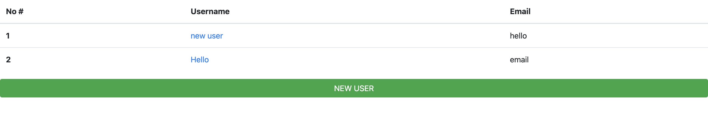

# Re-Former

> This is an example of a CRUD app using rails forms. The main features of the app is that all the functions work dynamically using forms. A user is able to create, edit, delete or view a user. Since it is to test backend logic styling is not the main emphasis of this project. Please follow the steps to get your local copy and play around. Happy Coding!!!

## Built With

- Ruby
- Ruby On Rails

## Getting Started

To get a local copy up and running follow these simple example steps:

### Prerequisites

- Install [Ruby](https://www.ruby-lang.org/en/)
- Get [Rails](https://rubyonrails.org/)

### Setup

- To get a local copy of the project open terminal
- run `git clone https://github.com/uzairali19/re-former.git`
- Then run `cd re-former`

### Usage

- To use the app on local machine make sure you are on the root directory `re-former`
- Open terminal and run `bundle install` to install all the dependecies then run `rails db:migrate`
- Finally run `rails server` go to your browser and type `localhost:3000`
- Now you can play around with creating, updating or deleting users.
- Don't forget to checkout the results on your terminal each time you make a change.

For example:

## Authors

👤 **Uzair Ali**

- GitHub: [@githubhandle](https://github.com/uzairali19)
- Twitter: [@twitterhandle](https://twitter.com/Uzairali751)
- LinkedIn: [LinkedIn](https://www.linkedin.com/in/uzairali19/)

## 🤝 Contributing

Contributions, issues, and feature requests are welcome!

Feel free to check the [issues page](https://github.com/uzairali19/re-former/issues/).

## Show your support

Give a ⭐️ if you like this project!

## Acknowledgments

- This project and details are available on the Odin Project, Be sure to check that out.

## 📝 License

This project is [MIT](./MIT.md) licensed. Please contact issues link for contributions.
